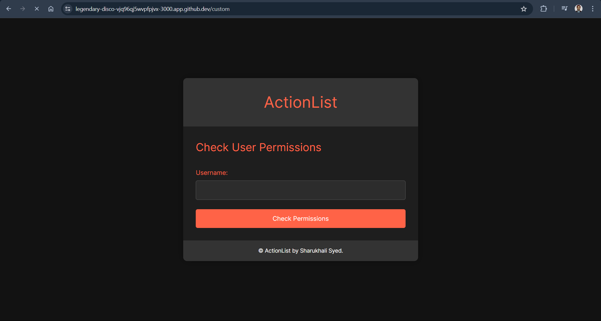

<h1 align="center">
  ActionList<br>
  <small>Convert your Tasks to Actions</small>
</h1>





<br>

# 📝 ActionList   
 **ActionList Web Application** Built a k8s controller that will allow the deployment of OPAL as part of the k8s platform. Developed an ActionList Webapp where users' karma and location affect their permissions to perform operations. Fetched the data dynamically from a MySQL server.

<br>

## 🪶 Features
- 📖 **User Karma and Location-Based Permissions** :
    - Dynamic Permission Management: Users' permissions to perform various operations within the application are dynamically managed based on their karma and location. This ensures personalized and context-specific access control.
    - Karma System: Users accumulate karma points through their interactions and contributions within the app, which affects their permissions and access levels.
    - Location-Based Access: Users' locations are used to further refine their access permissions, allowing for location-specific content and operations.
- ✒️ **Task Management Platform** :
    - User-Generated Content: Users can create, share, and browse tasks. This includes the ability to add detailed instructions, subtasks, and multimedia content such as images and videos.
    - Search and Filter Options: The app provides advanced search and filtering options to help users find tasks based on various criteria, including tags, categories, and user ratings.
- 🚀 **Kubernetes Integration** :
    - OPAL Deployment as a Kubernetes Controller: The application includes a Kubernetes controller to manage the deployment of OPAL as part of the Kubernetes platform, ensuring scalability and reliability.
    - Containerized Services: The app's backend services are containerized using Docker and deployed on Kubernetes, providing a robust and scalable infrastructure.
- 📰 **Database Integration** :
    - MySQL Backend: User data, tasks, and other relevant information are stored in a MySQL database. The app dynamically fetches data from the MySQL server as needed.
    - API Endpoints: The app provides RESTful API endpoints to interact with the MySQL database, enabling operations such as fetching user information and retrieving tasks based on permissions.
- 🔏 **Authentication and Authorization** :
    - User Authentication: Secure user authentication mechanisms are implemented to ensure that only authorized users can access and interact with the application.
    - Role-Based Access Control (RBAC): The application supports role-based access control, where different user roles have varying levels of access and permissions.
- 🖥️ **Monitoring and Logging** :
    - Responsive Design: The application is designed to be fully responsive, ensuring a seamless experience across different devices and screen sizes.
    - User-Friendly Interface: Intuitive navigation and a user-friendly interface enhance the overall user experience, making it easy for users to interact with the app.

- 🕸️ **Next.js Frontend** :
    - React-Based User Interface: The frontend is built using Next.js, providing a fast and responsive user experience.
    - Server-Side Rendering (SSR): Next.js enables server-side rendering, which improves performance and SEO for the web application.
    - Real-Time Updates: The app fetches data dynamically and updates the user interface in real-time as users interact with the application.

<br>

# :books: Index

- [Demo](#movie_camera-Demo)
- [Screenshots](#screenshots)
- [Project Tree](#project-tree)
- [Use Cases](#other-real-world-use-cases-of-opal-open-policy-administration-layer)
- [Set Up](#outbox_tray-Set-up)
- [Contribute](#building_construction-Contribute)
- [Project Author](#people_holding_hands-Meet-the-Author)
- [Contact](#email-contact)

<br>

##  :movie_camera: Demo
- After a brief introduction, let's dive a little more inside the project.
- Here is the walk-through of **ActionList 📝**. If you want to witness a more HD version, [click here](https://youtu.be/lLmQM-04PTc)

<br>

## Project Tree
```bash
OPAL-K8/
├── api/
│   └── v1alpha1/
│       ├── groupversion_info.go
│       ├── opalcontroller_types.go
│       └── zz_generated.deepcopy.go
├── config/
│   ├── certmanager/
│   │   ├── certificate.yaml
│   │   ├── kustomization.yaml
│   │   └── kustomizeconfig.yaml
│   ├── crd/
│   │   ├── bases/
│   │   │   └── ai-apex-dev.github.io_opalcontrollers.yaml
│   │   ├── kustomization.yaml
│   │   └── patches/
│   │       └── cainjection_in_opalcontrollers.yaml
│   ├── default/
│   │   ├── kustomization.yaml
│   │   └── manager_auth_proxy_patch.yaml
│   ├── manager/
│   │   ├── controller_manager_config.yaml
│   │   ├── kustomization.yaml
│   │   └── manager.yaml
│   ├── prometheus/
│   │   ├── kustomization.yaml
│   │   └── monitor.yaml
│   ├── rbac/
│   │   ├── auth_proxy_client_clusterrole.yaml
│   │   ├── auth_proxy_role.yaml
│   │   ├── auth_proxy_role_binding.yaml
│   │   ├── auth_proxy_service.yaml
│   │   ├── kustomization.yaml
│   │   ├── leader_election_role.yaml
│   │   ├── leader_election_role_binding.yaml
│   │   ├── opalcontroller_editor_role.yaml
│   │   ├── opalcontroller_viewer_role.yaml
│   │   ├── role_binding.yaml
│   │   └── service_account.yaml
│   ├── samples/
│   │   └── ai-apex-dev_v1alpha1_opalcontroller.yaml
│   └── webhook/
│       ├── kustomization.yaml
│       ├── kustomizeconfig.yaml
│       ├── service.yaml
│       └── webhook.yaml
├── controllers/
│   └── opalcontroller_controller.go
├── database/
│   └── SQL/
│       ├── karma_location.sql
│       ├── karma_location_with_output.sql
│       ├── task.sql
│       └── user.sql
├── deployment/
│   ├── mysql-deployment.yaml
│   ├── opal-controller-deployment.yaml
│   ├── opal-service.yaml
│   ├── actionlist-deployment.yaml
│   └── actionlist-service.yaml
├── hack/
│   └── boilerplate.go.txt
├── task-management-app/
│   ├── backend/
│   │   ├── Dockerfile
│   │   ├── app.py
│   │   ├── requirements.txt
│   │   └── templates/
│   │       └── index.html
│   └── frontend/
│       ├── Dockerfile
│       ├── package-lock.json
│       ├── package.json
│       └── src/
│           ├── App.js
│           ├── App.test.js
│           ├── index.css
│           ├── index.js
│           ├── logo.svg
│           ├── reportWebVitals.js
│           └── setupTests.js
├── .dockerignore
├── .gitignore
├── .gitpod.yml
├── Dockerfile
├── Makefile
├── PROJECT
├── README.md
├── docker-compose.yml
├── go.mod
├── go.sum
├── main.go
├── package-lock.json
├── package.json
├── policy.yaml
└── rbac.rego

<br><br>

## Dependecies
1. **Next.js**
2. *React*
3. **Axios**
4. *Node.js*
5. **Express**
6. *MySQL*
7. **OPAL**
8. *Kubectl*
4. *Helm*
5. **Docker**

##  :outbox_tray: Installation Guide
These are the steps required to install and run the ActionList project:


1. Clone the Repository: Open a terminal or command prompt and clone the ActionList repository from GitHub using the following command:

  ```bash
    git clone https://github.com/ai-apex-dev/actionlist.git
  ```

2. Navigate to the Repository Directory: Change your current directory to the cloned actionlist repository:

  ```bash
    cd OPAL-K8
  ```
3. Kubernetes Controller to Deploy OPAL
    - Prerequisites
        - A running Kubernetes cluster (local or cloud-based).
        - Docker installed on your local machine.
        - kubectl configured to interact with your Kubernetes cluster.
        - Go programming language installed.

    - Step 1: Set Up a Kubernetes Cluster
        - You can use Minikube for local development or a cloud provider like GKE, EKS, or AKS for a production-ready cluster.

    - Step 2: Create the Kubernetes Controller
        - Define the Custom Resource Definitions (CRDs)
        - Create the Controller Code
    - Step 3: Build and Deploy the Controller
        1. Build the Controller Image
        ```docker
        docker build -t mycompany/opal-controller:latest .
        ``` 
        2. Push the Image to a Registry
        ```docker
        docker push mycompany/opal-controller:latest
        ```
        3. Deploy the Controller to the Cluster
        4. Apply the deployment
        ```kubectl
        kubectl apply -f opal_crd.yaml
        kubectl apply -f controller_deployment.yaml
        ```
4. Web Application with Dynamic Permissions
    - Prerequisites
        - Node.js and npm installed.
        - MySQL server running and configured.
    - Step 1: Set Up a Next.js Project
        1. Install Required Dependencies
        ```
        npm install axios mysql2
        ```
        2. Run the project
        ```sh
        npm run dev
        ```
<br>

> Note: The running port should look like this:
Open `http://localhost:3000` in your web browser to see the list of users and todo list filtered by karma.

<br>
<br>

